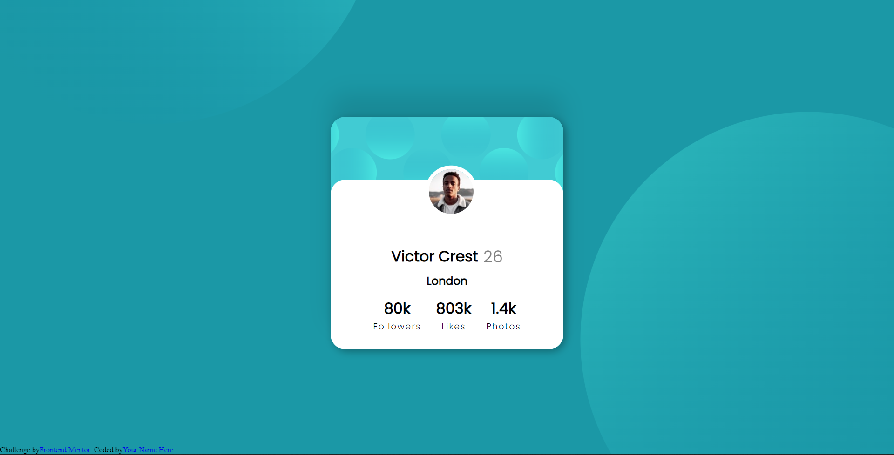

# Frontend Mentor - Profile card component solution

## Overview

### The challenge

- Build out the project to the designs provided

### Screenshot

### Links

### Built with
- Semantic HTML5 markup
- CSS custom properties
- Flexbox

### What I learned
This challenge really helped me to refresh my HTML and CSS knowledge and motivated me to do more.

## Author